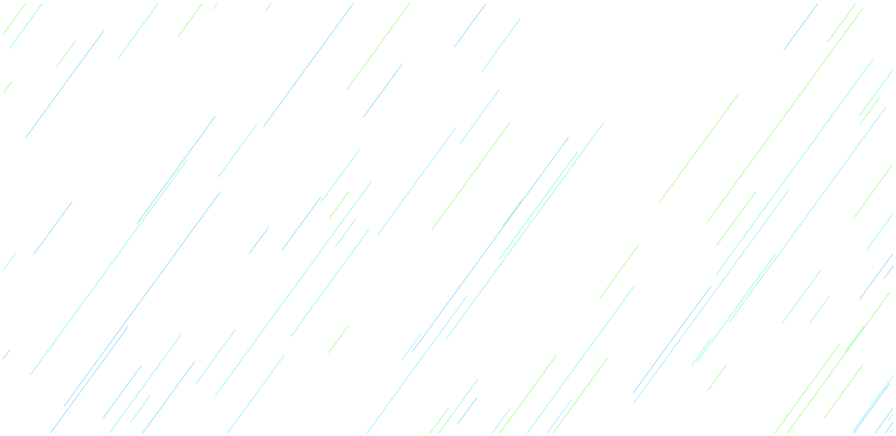
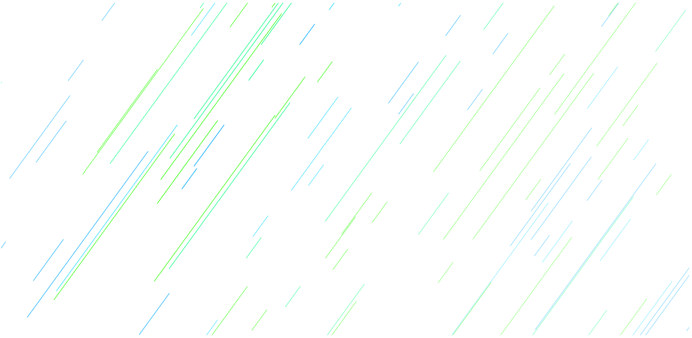

# PIXI Falling Stars Visualization

A visualization of falling stars using the [PixiJS](https://www.pixijs.com) library.



I created this visualization whilst working on [my personal website](https://sveinnthorarins.github.io).

I used blue and green colors to fit into my theme but the colors can of course be changed in the source code to your liking.

The visualization has a hover effect. When the pointer/mouse hovers over it the nearest stars will light up brighter (having more alpha). The distance is calculated by imagining the pointer is also following a tilted line similar to the falling stars and then calculating the distance between the pointer's line and the stars' lines.



# Technical details

This is a [TypeScript](https://www.typescriptlang.org/) project.

A few npm scripts exist in the `package.json`:

```
npm run tsc
```

This will compile the TypeScript source code to JavaScript, from the `src-ts` folder into a folder called `src-generated-js`.

```
npm run bundle
```

This will bundle the generated JavaScript code into one bundle file called `bundle.js`.

Then there are two additional scripts to perform these operations as soon as a file change occurs. Those can be executed with the commands `npm run tsc-watch` and `npm run bundle-watch`.

---

All that is needed to run the project is to open the `index.html` file in a browser (the html file includes a canvas element and links to the `bundle.js` file).
